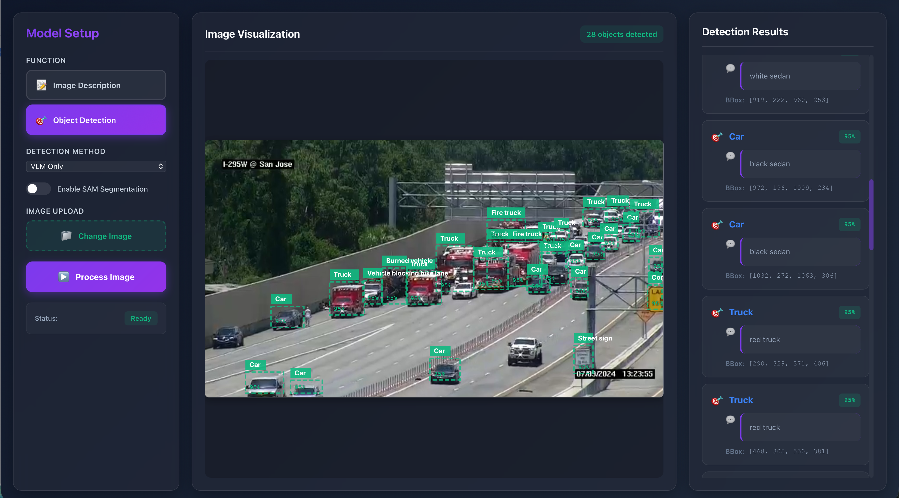
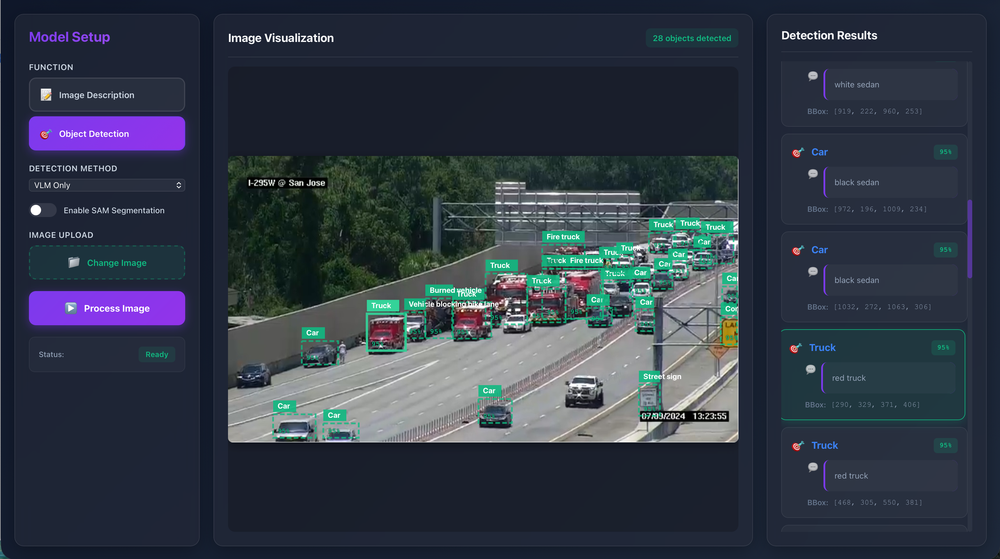

# VisionLangAnnotate

<p align="center">
  
  
  
</p>

## 🔍 Overview

VisionLangAnnotate is an advanced vision-language annotation framework that enables dynamic object detection and annotation based on natural language prompts. By combining traditional computer vision models with state-of-the-art Vision-Language Models (VLMs), it offers a flexible and powerful solution for object detection, segmentation, and annotation tasks.

## ✨ Key Features

- **Prompt-Driven Object Detection**: Detect objects based on natural language descriptions
- **Multi-Model Integration**: Combines traditional object detectors with Vision-Language Models
- **Dynamic Annotation**: Generate annotations on-the-fly based on user requests
- **Video Processing**: Support for both image and video inputs
- **Zero-Shot Capabilities**: Detect novel objects without prior training
- **Unified API**: Simple interface for various detection and annotation tasks
- **Label Studio Integration**: Export detection results to Label Studio compatible JSON format for human validation and re-annotation
- **Complete Annotation Loop**: End-to-end pipeline from user requests to data pre-processing, object detection, vision annotation, and human validation

## 🏗️ Architecture

VisionLangAnnotate consists of two main components:

### 1. Traditional Object Detection Pipeline

Located in `VisionLangAnnotateModels/detectors/`, this component includes:

- Multiple object detection models (DETR, YOLO, RT-DETR)
- Unified inference interface (`ModelInference`)
- Video processing pipeline (`videopipeline.py`)
- Ensemble detection capabilities
- Evaluation tools and metrics

### 2. Vision-Language Models (VLM) Backend

#### Unified VLM Classifier (`vlm_classifierv4.py`)

The unified VLM backend provides a flexible interface for multiple Vision-Language Models with support for various backends:

**Supported Model Architectures:**
- **BLIP-2**: Salesforce/blip2-opt-2.7b, blip2-flan-t5-xxl
- **LLaVA**: llava-hf/llava-1.5-7b-hf, llava-v1.6-mistral-7b-hf
- **Qwen2.5-VL**: Qwen/Qwen2.5-VL-7B-Instruct (with Flash Attention 2 support)
- **SmolVLM**: HuggingFaceTB/SmolVLM-Instruct
- **GLM-4.5V/4.1V**: zai-org/GLM-4.5V (multimodal reasoning)

**Backend Support:**
- `HuggingFaceVLM`: Direct Transformers inference
- `OpenAIVLM`: OpenAI API (GPT-4V, GPT-4o)
- `OllamaVLM`: Local Ollama models
- `vLLMBackend`: High-performance vLLM inference

Example usage:
```python
from VisionLangAnnotateModels.VLM.vlm_classifierv4 import HuggingFaceVLM

# Initialize with Qwen2.5-VL
vlm = HuggingFaceVLM(
    model_name="Qwen/Qwen2.5-VL-7B-Instruct",
    device="cuda"
)

# Generate descriptions
results = vlm.generate(
    images=[image],
    prompts=["Describe this image in detail"]
)
```

#### Qwen Object Detection Pipeline (`qwen_object_detection_pipeline3.py`)

Advanced object detection pipeline with hybrid fusion approaches:

**Detection Modes:**
1. **VLM-Only Detection**: Pure vision-language model detection
   - Uses structured prompts for consistent bbox output
   - Format: `Object_name: (x1,y1,x2,y2) confidence description`

2. **Hybrid Mode** (Parallel Fusion):
   - Combines VLM with traditional detectors (YOLO, DETR)
   - Runs VLM and traditional detectors in parallel
   - Ensemble fusion using NMS or Weighted Boxes Fusion (WBF)
   - VLM provides descriptions for traditional detector bboxes

3. **Hybrid-Sequential Mode**:
   - Traditional detectors generate initial bboxes
   - VLM processes cropped regions for detailed descriptions
   - Optimized batch processing for multiple regions
   - Higher accuracy with sequential validation

**Key Features:**
- SAM (Segment Anything Model) integration for precise segmentation
- Multiple backend support (HuggingFace, vLLM, Ollama)
- Smart box optimization and merging
- Label Studio compatible JSON export
- Comprehensive visualization with bbox, labels, and confidence scores

Example usage:
```python
from VisionLangAnnotateModels.VLM.qwen_object_detection_pipeline3 import QwenObjectDetectionPipeline

# Initialize with hybrid mode
pipeline = QwenObjectDetectionPipeline(
    model_name="Qwen/Qwen2.5-VL-7B-Instruct",
    device="cuda",
    enable_sam=True,
    enable_traditional_detectors=True,
    traditional_detectors=['yolo', 'detr'],
    vlm_backend="huggingface"
)

# VLM-only detection
results = pipeline.detect_objects(
    "path/to/image.jpg",
    use_sam_segmentation=True
)

# Hybrid detection (parallel)
results = pipeline.detect_objects_hybrid(
    "path/to/image.jpg",
    use_sam_segmentation=True,
    sequential_mode=False
)

# Hybrid-sequential detection
results = pipeline.detect_objects_hybrid(
    "path/to/image.jpg",
    use_sam_segmentation=True,
    sequential_mode=True
)
```

**Fusion Approaches:**

1. **Ensemble Fusion (NMS/WBF)**:
   ```python
   # Combines detections from multiple sources
   # - Removes duplicates using IoU threshold
   # - WBF weights boxes by confidence
   # - Preserves bbox diversity
   ensembled = ensemble_detections(
       [traditional_dets, vlm_dets],
       method='wbf',
       iou_thr=0.5
   )
   ```

2. **IoU-based Matching**:
   ```python
   # Matches VLM detections to traditional detections
   # - Uses IoU threshold (default 0.3)
   # - Prioritizes VLM descriptions for matched boxes
   # - Keeps unmatched detections from both sources
   ```

3. **Overlap-based Matching**:
   ```python
   # More lenient matching using overlap ratio
   # - Computes intersection over smaller box area
   # - Better for nested or partially overlapping objects
   ```

### 3. Annotation and Validation Pipeline

The project includes tools for exporting detection results to Label Studio:

- Export detection results to Label Studio compatible JSON format (`export_to_label_studio.py`)
- Integration with Google Cloud Storage for data management (`utils/labelstudiogcp.py`)
- Complete workflow from automatic detection to human validation and re-annotation
- Feedback loop for continuous model improvement based on validated annotations

## 🎨 User Interfaces

### Gradio Application (`tools/gradio_vlm.py`)

Interactive web interface for object detection and image analysis:

**Features:**
- **Image Description Tab**: Generate natural language descriptions with custom prompts
- **Object Detection Tab**: 
  - Three detection methods (VLM Only, Hybrid Mode, Hybrid-Sequential)
  - SAM segmentation toggle
  - Real-time visualization gallery
  - JSON annotation download
- **Video Processing Tab**:
  - Video upload and playback
  - Frame-by-frame analysis results
  - Result browsing with prev/next navigation

**Running the Gradio App:**
```bash
cd tools
python gradio_vlm.py \
  --checkpoint-path Qwen/Qwen2.5-VL-7B-Instruct \
  --backend huggingface \
  --server-port 7860
```

Visit `http://localhost:7860` to access the Gradio interface.

### FastAPI Backend (`backend/`)

Production-ready REST API for VLM operations:

**Architecture:**
- `src/main.py`: FastAPI application with CORS support
- `src/models.py`: Pydantic models for request/response validation
- `src/api/vlm.py`: VLM endpoint router (7 endpoints)
- `src/pipeline.py`: Singleton pipeline management
- `src/config.py`: Environment-based configuration

**API Endpoints:**
```
GET  /api/vlm/backend-info              # Backend status
POST /api/vlm/describe-image/{filename} # Image description
POST /api/vlm/detect-objects/{filename} # Object detection
POST /api/vlm/analyze-video/{filename}  # Video analysis
GET  /api/vlm/visualization/{filename}  # Get visualization
GET  /api/vlm/segmentation/{filename}   # Get segmentation
GET  /api/vlm/annotation/{filename}     # Get JSON annotation
```

**Starting the Backend:**
```bash
cd backend
uvicorn src.main:app --reload --host 0.0.0.0 --port 8000
```

API documentation available at: `http://localhost:8000/docs`

### React Frontend (`frontend/`)

Modern, professional three-panel interface:


*Three-panel VLM interface with interactive object detection visualization*


*Interactive hover synchronization between bounding boxes and object list*

**Layout:**
- **Left Panel**: Model controls (function selector, detection method, SAM toggle, image upload)
- **Center Panel**: Image visualization with interactive SVG bounding boxes
- **Right Panel**: Detailed output with two-level object hierarchy (class + description)

**Interactive Features:**
- Bidirectional hover synchronization between bboxes and object list
- Smooth pulse animations on hover
- Auto-scroll to hovered items
- Glassmorphism design with modern color scheme
- Fully responsive layout

**Starting the Frontend:**
```bash
cd frontend
npm install
npm run dev
```

Visit `http://localhost:5173` to access the React interface.

**Complete Stack Usage:**
```bash
# Terminal 1: Start FastAPI backend
cd backend && uvicorn src.main:app --reload

# Terminal 2: Start React frontend
cd frontend && npm run dev

# Access at http://localhost:5173
```

## 🚀 Usage Examples

### Using the Unified VLM Backend

```python
from VisionLangAnnotateModels.VLM.vlm_classifierv4 import HuggingFaceVLM
from PIL import Image

# Initialize with Qwen2.5-VL (Flash Attention 2)
vlm = HuggingFaceVLM(
    model_name="Qwen/Qwen2.5-VL-7B-Instruct",
    device="cuda"
)

# Load image
image = Image.open("path/to/image.jpg")

# Generate description
descriptions = vlm.generate(
    images=[image],
    prompts=["Describe this image in detail"]
)
print(descriptions[0])

# Use other supported models
# llava_vlm = HuggingFaceVLM("llava-hf/llava-1.5-7b-hf", "cuda")
# glm_vlm = HuggingFaceVLM("zai-org/GLM-4.5V", "cuda")
```

### Qwen Object Detection - VLM Only Mode

```python
from VisionLangAnnotateModels.VLM.qwen_object_detection_pipeline3 import QwenObjectDetectionPipeline

# Initialize pipeline with VLM-only mode
pipeline = QwenObjectDetectionPipeline(
    model_name="Qwen/Qwen2.5-VL-7B-Instruct",
    device="cuda",
    output_dir="./detection_results",
    enable_sam=True,  # Enable SAM for segmentation
    enable_traditional_detectors=False,  # VLM-only
    vlm_backend="huggingface"
)

# Detect objects
results = pipeline.detect_objects(
    image_path="path/to/image.jpg",
    use_sam_segmentation=True,
    save_results=True
)

# Access results
print(f"Found {len(results['objects'])} objects")
for obj in results['objects']:
    print(f"{obj['label']}: {obj['bbox']} - {obj['description']}")

# View visualization
visualization_path = results['visualization_path']
```

### Qwen Object Detection - Hybrid Parallel Mode

```python
# Initialize with traditional detectors
pipeline = QwenObjectDetectionPipeline(
    model_name="Qwen/Qwen2.5-VL-7B-Instruct",
    device="cuda",
    enable_sam=True,
    enable_traditional_detectors=True,
    traditional_detectors=['yolo', 'detr'],  # Multiple detectors
    vlm_backend="huggingface"
)

# Hybrid detection (parallel fusion)
results = pipeline.detect_objects_hybrid(
    image_path="path/to/image.jpg",
    use_sam_segmentation=True,
    sequential_mode=False,  # Parallel mode
    save_results=True
)

# Results include detections from VLM + YOLO + DETR
# Fused using Weighted Boxes Fusion (WBF)
print(f"Raw response: {results['raw_response']}")
print(f"Visualization: {results['visualization_path']}")
print(f"JSON annotations: {results['json_path']}")
```

### Qwen Object Detection - Hybrid Sequential Mode

```python
# Sequential mode: Traditional detectors → VLM validation
results = pipeline.detect_objects_hybrid(
    image_path="path/to/image.jpg",
    use_sam_segmentation=True,
    sequential_mode=True,  # Sequential mode
    cropped_sequential_mode=False,
    save_results=True
)

# In sequential mode:
# 1. Traditional detectors generate initial bboxes
# 2. VLM processes each cropped region
# 3. VLM provides detailed descriptions
# 4. Higher accuracy with validation

# Access segmentation masks (if SAM enabled)
if results.get('segmentation_path'):
    print(f"Segmentation: {results['segmentation_path']}")
```

### Using the FastAPI Backend

```python
import requests

# Upload image
files = {'file': open('image.jpg', 'rb')}
upload_response = requests.post('http://localhost:8000/api/upload', files=files)
filename = upload_response.json()['filename']

# Image description
desc_response = requests.post(
    f'http://localhost:8000/api/vlm/describe-image/{filename}',
    json={'custom_prompt': 'What is in this image?'}
)
print(desc_response.json()['description'])

# Object detection (Hybrid mode)
det_response = requests.post(
    f'http://localhost:8000/api/vlm/detect-objects/{filename}',
    json={
        'detection_method': 'Hybrid Mode',
        'use_sam_segmentation': True
    }
)

results = det_response.json()
print(f"Detected {results['num_objects']} objects")
for obj in results['objects']:
    print(f"{obj['label']}: {obj['description']}")

# Download visualization
viz_url = f"http://localhost:8000/api/vlm/visualization/{results['visualization_paths'][0]}"
```

### Using the Gradio Interface

```bash
# Start Gradio app with Qwen model
python tools/gradio_vlm.py \
  --checkpoint-path Qwen/Qwen2.5-VL-7B-Instruct \
  --backend huggingface \
  --enable-sam \
  --enable-traditional-detectors \
  --traditional-detectors yolo,detr \
  --server-port 7860
```

Then open `http://localhost:7860` in your browser:
1. Upload an image
2. Select detection mode (VLM Only, Hybrid, or Hybrid-Sequential)
3. Toggle SAM segmentation
4. Click "Detect Objects"
5. View results in the gallery
6. Download JSON annotations

### Video Processing

```python
from VisionLangAnnotateModels.detectors.videopipeline import VideoPipeline

# Initialize the video pipeline
video_pipeline = VideoPipeline(detector_name="yolov8x")

# Process a video file
detections = video_pipeline.process_video(
    video_path="path/to/video.mp4",
    output_path="path/to/output.mp4"
)
```

### Label Studio Export

```python
from VisionLangAnnotateModels.export_to_label_studio import export_detections_to_label_studio

# Export detection results to Label Studio format
export_detections_to_label_studio(
    detections=results,
    image_path="path/to/image.jpg",
    output_path="label_studio_annotations.json"
)

# For GCP integration
from VisionLangAnnotateModels.utils.labelstudiogcp import upload_to_gcs

# Upload annotations to Google Cloud Storage
upload_to_gcs(
    local_file_path="label_studio_annotations.json",
    bucket_name="your-bucket-name",
    destination_blob_name="annotations/label_studio_annotations.json"
)
```

## 🌆 Application: AI City Issue Detection System

The **AI City Issue Detection System** is a real-time monitoring solution that leverages the **VisionLangAnnotate** framework to automatically detect and annotate urban issues from city camera streams. By combining traditional deep learning-based object detection with **Vision-Language Models (VLMs)**, the system can identify a wide range of urban problems through natural language prompts and generate detailed annotations to support rapid response and resolution.

### 1. Data Acquisition Layer
- **Camera Stream Integration**: Connects to existing city surveillance cameras and traffic monitoring systems.
- **Video Processing Pipeline**: Extracts frames via scene change detection at configurable intervals for analysis and processes data in Google Cloud Storage buckets.
- **Edge Computing Support**: Deploys lightweight models on edge devices for initial filtering.
- **Privacy Protection**: Leverages deep learning models to automatically detect and blur human faces and license plate numbers in video streams.

### 2. Detection and Analysis Layer
- **Deep Learning-based Object Detection**: Identifies common urban objects such as vehicles, pedestrians, and infrastructure.
  - YOLO-based detectors for real-time performance.
  - DETR models for complex scene understanding.
  - Ensemble approaches to improve accuracy.
- **Vision-Language Model Processing**:
  - Zero-shot detection using Grounding DINO + SAM for novel issue types, with SAM providing precise object segmentation.
  - Natural language prompt processing (e.g., "Find potholes", "Detect broken streetlights") with VLM validation of detected object types, generation of detailed issue descriptions, and output in structured format for followup processing.
  - Region captioning to describe detected issues in detail.

### 3. Issue Classification and Prioritization
- **Issue Type Categorization**:
  - Infrastructure damage (e.g., potholes, cracks, broken facilities).
  - Traffic violations (e.g., illegal parking, wrong-way driving).
  - Safety hazards (e.g., fallen trees, flooding, debris).
  - Public space misuse (e.g., illegal dumping, graffiti).
- **Severity Assessment**:
  - Automatically prioritizes issues based on safety impact.
  - Tracks conditions over time to detect deterioration.

### 4. Annotation and Validation Loop
- **Automatic Annotation Generation**:
  - Generates bounding boxes and segmentation masks for detected issues.
  - Produces descriptive captions using VLMs.
  - Attaches metadata including location, timestamp, and severity.
- **Label Studio Integration**:
  - Exports annotations in Label Studio-compatible JSON format.
  - Supports human expert validation and correction workflow.
  - Incorporates a feedback loop for continuous model improvement.

### 5. Response and Monitoring System
- **Real-Time Alerts**:
  - Sends notifications for high-priority issues.
  - Integrates with city maintenance and management systems.
- **Issue Tracking Dashboard**:
  - Visualizes detected issues on a city map.
  - Supports historical data analysis and trend identification.
  - Tracks performance metrics and response times.

## 🛠️ Repository Setup
```bash
git clone https://github.com/lkk688/VisionLangAnnotate.git
cd VisionLangAnnotate
% conda env list
% conda activate mypy311
pip freeze > requirements.txt
pip install -r requirements.txt
#Install in Development Mode
#pip install -e .
pip install flit
flit install --symlink
#test import models: >>> import VisionLangAnnotateModels
```

Create Conda virtual environment and install cuda
```bash
conda create --name py312 python=3.12
conda activate py312
conda info --envs #check existing conda environment
% conda env list
$ conda install cuda -c nvidia/label/cuda-12.6
pip3 install torch torchvision torchaudio --index-url https://download.pytorch.org/whl/cu126
pip install mkdocs mkdocs-material
```

```bash
#test backend
uvicorn src.main:app --reload
#Verify at: http://localhost:8000
```

```bash
# Frontend (runs on localhost:5173)
cd frontend && npm run dev

# Backend (runs on localhost:8000)
uvicorn backend.src.main:app --reload
```

## ⚠️ Common Warnings and Solutions

When importing VisionLangAnnotateModels, you may encounter these warnings:

### TensorFlow/CUDA Warnings
```
TensorFlow warnings about CUDA, cuDNN, or GPU optimization
```
**Solution**: These are informational warnings and don't affect functionality. To suppress them:
```bash
export TF_CPP_MIN_LOG_LEVEL=2  # Suppress TensorFlow warnings
```

### Ollama Utilities Warning
```
WARNING: Ollama utilities could not be imported. Ollama-based models will not be available.
```
**Solution**: Install Ollama if you need local LLM support:
```bash
# Install Ollama
curl -fsSL https://ollama.ai/install.sh | sh
# Or visit: https://ollama.ai/download
```

### vLLM Package Warning
```
WARNING: vLLM package is not available. Some VLM features may be limited.
```
**Solution**: Install vLLM for enhanced VLM performance (see vLLM Setup Guide below).

## 🚀 vLLM Setup Guide

vLLM provides high-performance inference for Vision Language Models. Follow these steps:

### Prerequisites
- CUDA-compatible GPU (recommended: RTX 3090, RTX 4090, or better)
- CUDA 11.8+ or 12.1+
- Python 3.8-3.11

### Installation
```bash
# Method 1: Install from PyPI (recommended)
pip install vllm

# Method 2: Install with CUDA 12.1 support
pip install vllm --extra-index-url https://download.pytorch.org/whl/cu121

# Method 3: Install from source (for latest features)
git clone https://github.com/vllm-project/vllm.git
cd vllm
pip install -e .
```

### Verify Installation
```python
# Test vLLM installation
try:
    from vllm import LLM, SamplingParams
    print("vLLM installed successfully!")
except ImportError as e:
    print(f"vLLM installation issue: {e}")
```

### GPU Memory Requirements
- **7B models**: 16GB+ VRAM
- **13B models**: 24GB+ VRAM  
- **70B models**: 80GB+ VRAM (multi-GPU setup)

### Troubleshooting
- **CUDA out of memory**: Reduce `max_model_len` or use tensor parallelism
- **Import errors**: Ensure CUDA toolkit matches PyTorch CUDA version
- **Performance issues**: Enable GPU P2P communication for multi-GPU setups

```bash
#Set Up React Frontend
cd ../frontend
brew install node
npm create vite@latest . --template react 
#choose react, JavaScript+SWC(Speedy Web Compiler) a Rust-based alternative to Babel.
npm install
#run the frontend
npm run dev
```

```bash
npm install @vitejs/plugin-react --save-dev
npm install react-router-dom
```

Documents
```bash
pip install mkdocs mkdocs-material
docs % mkdocs new .
docs % ls
docs                    getting-started.md      mkdocs.yml
#Run locally:
mkdocs serve --dev-addr localhost:8001  #Docs will be at: http://localhost:8001, default port is 8000
#find the process using port 8000
lsof -i :8000
#kill -9 <PID>
```

Git setup
```bash
git add .
git commit -m "Initial setup: FastAPI + React + Docs"
git push origin main
```

Dockerize: backend/Dockerfile
Backend: Deploy FastAPI (Render, Railway).
Frontend: Deploy React (Vercel, Netlify).

## GCP Setup
Install gcloud cli from https://cloud.google.com/sdk/docs/install-sdk#deb
```bash
gcloud init
gcloud auth login
gcloud config set project <project_id>
gcloud config set compute/zone <zone>
$ gcloud projects list
gsutil ls gs://roadsafetytarget/
gsutil ls "gs://roadsafetysource/Sweeper 19303/"
gcloud auth application-default login
```

## VLM Backends
Ollama installation: [ollama linux](https://ollama.com/download/linux)
```bash
curl -fsSL https://ollama.com/install.sh | sh
ollama pull gpt-oss:20b
ollama run gpt-oss:20b
```
Ollama exposes a Chat Completions-compatible API, so you can use the OpenAI SDK

## 🌐 Web Interface

VisionLangAnnotate provides a modern web interface built with React and FastAPI:

- **Backend**: FastAPI server with WebSocket support for real-time processing
- **Frontend**: React-based UI with intuitive controls for uploading media and entering prompts
- **API**: RESTful endpoints for programmatic access to all features

### Starting the Web Interface

```bash
# Start the backend server
uvicorn src.main:app --reload

# In a separate terminal, start the frontend
cd frontend
npm run dev
```

Visit `http://localhost:5173` to access the web interface.

## 📊 Evaluation and Metrics

VisionLangAnnotate includes tools for evaluating detection performance:

- Precision, Recall, and F1-score metrics
- Visualization of detection results
- Comparison between different models and approaches
- Benchmark datasets and evaluation scripts

## 🔄 Complete Annotation Loop

VisionLangAnnotate creates a complete annotation workflow:

1. **User Request**: Start with natural language prompts describing objects to detect
2. **Data Pre-processing**: Prepare images or videos for detection
3. **Automatic Detection**: Apply traditional detectors or VLMs based on the prompt
4. **Result Export**: Generate Label Studio compatible JSON format
5. **Human Validation**: Review and correct annotations in Label Studio
6. **Feedback Integration**: Use validated annotations to improve models
7. **Continuous Improvement**: Retrain or fine-tune models with validated data

This closed-loop system combines the efficiency of automatic detection with the accuracy of human validation, creating a powerful tool for building high-quality annotated datasets.

